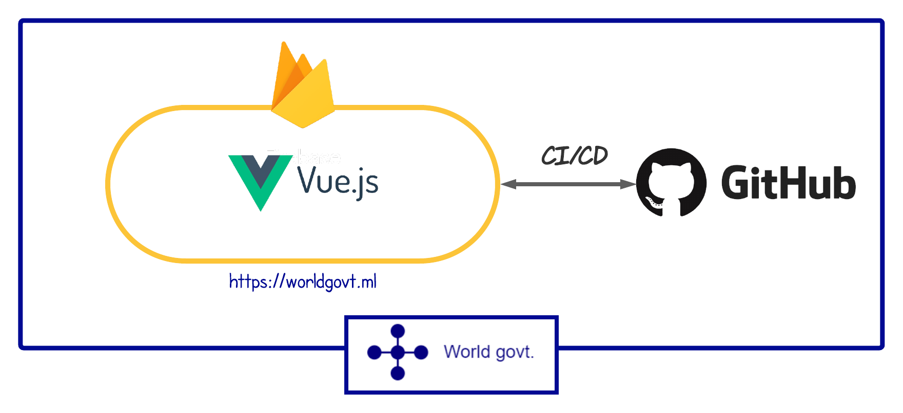
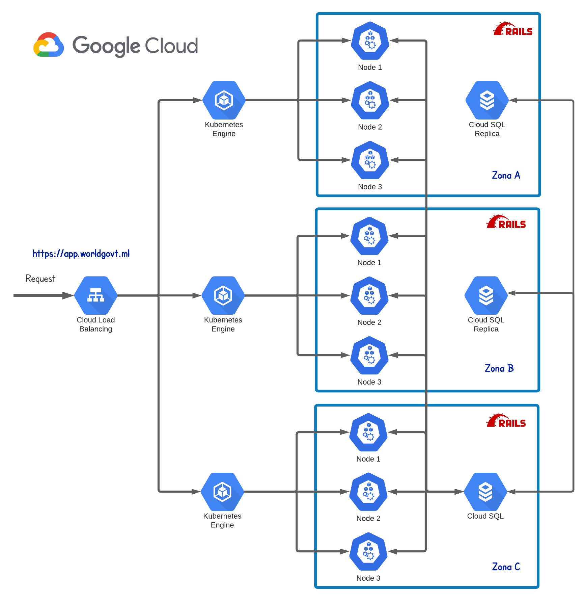
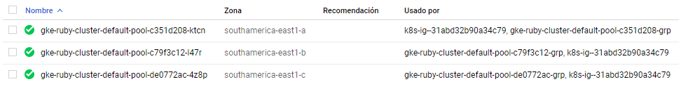
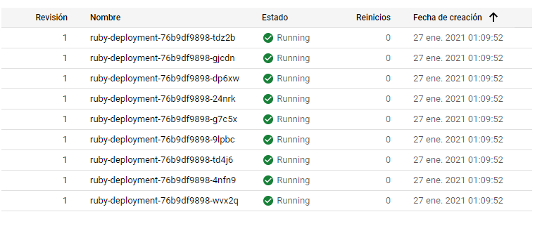
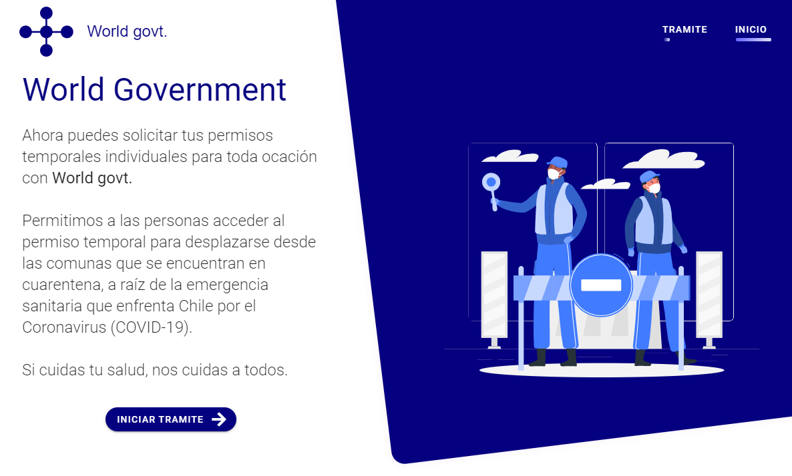
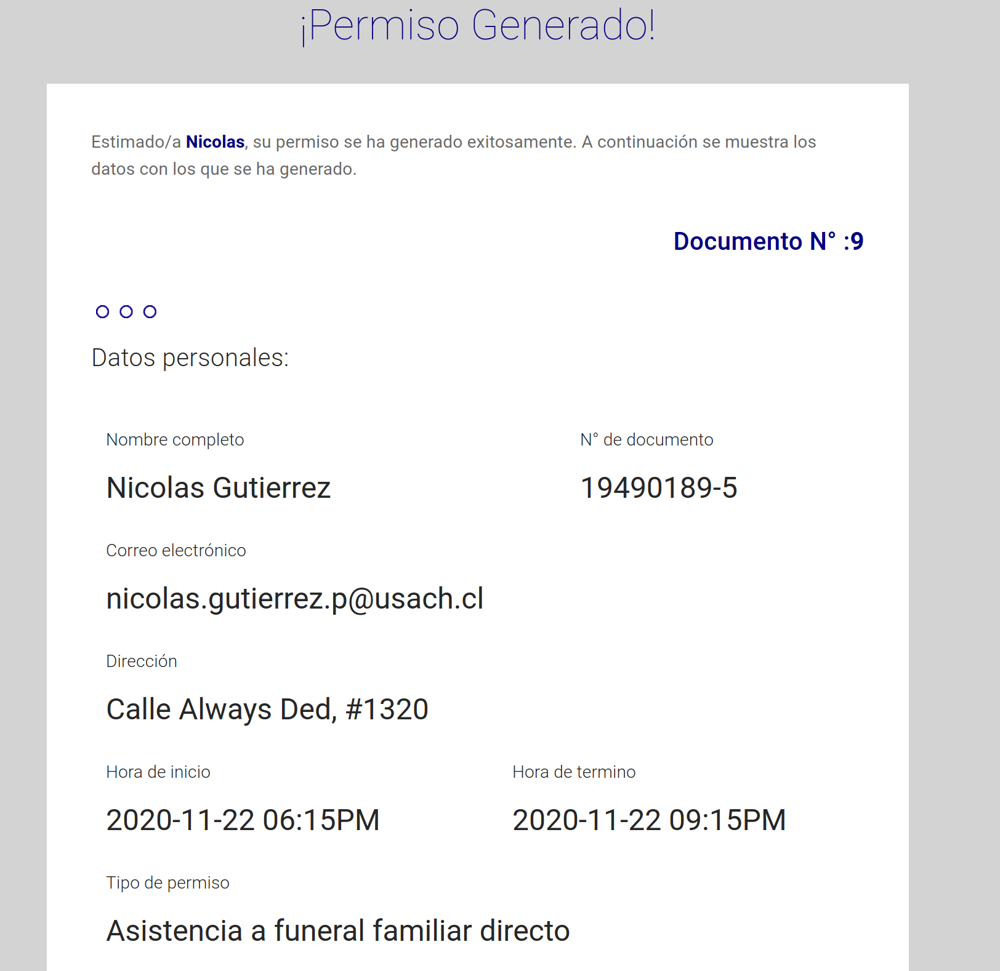
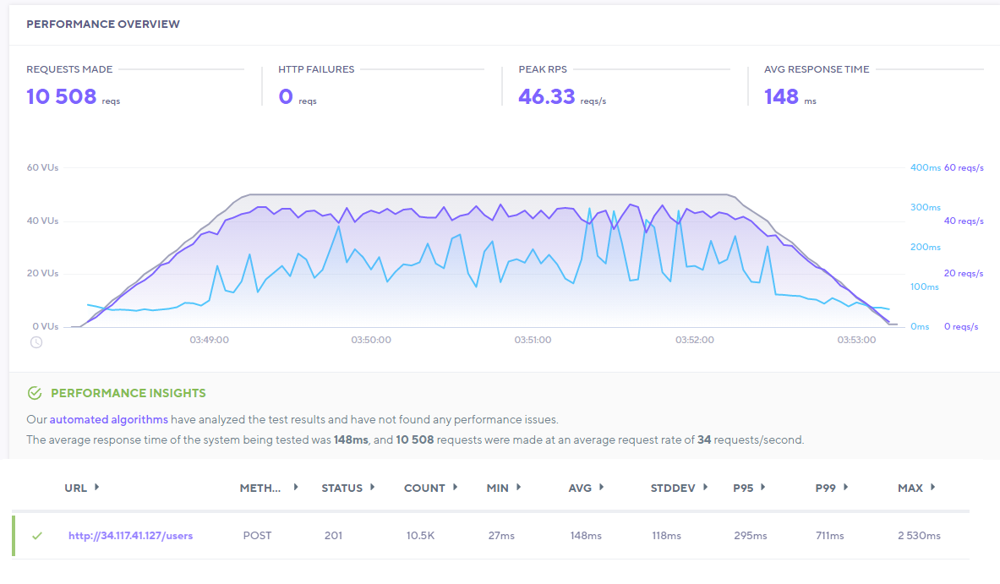

# Sistemas Distribuidos 2-2020

Integrantes del grupo:

  - Nicolás Gutiérrez - [ngutierrezp](https://github.com/ngutierrezp)
  - Javier Pérez -[JavierPerezCaceres](https://github.com/JavierPerezCaceres)

## PEP-2

En esta entrega se requiere la implementación de un **sistema distribuido** que pueda generar y hacer envíos de correos de permisos basados en la plataforma [Comisaria Virtual](https://comisariavirtual.cl/). 

Los requisitos de esta implementación es la creación de un sistema distribuido con un frontend y backend conectado a una base de datos. Se solicita además que :

  * Un formulario web básico de entrada de datos (RUN/DNI, Nombre, Dirección, Motivo del permiso)

  * Un sistema/modulo backend que se encargará de determinar la fecha y hora de solicitud del permiso, agregar una ventana de 15 minutos para la validez de este y escribir sobre la base de datos (tercer elemento) los datos del permiso generado.

  * Una tabla de base de datos, en la cual se almacenen todos los permisos generados.

## Tecnologías utilizadas

Las tecnologías utilizadas son:

* Vue.js (JavaScript)
* Ruby on Rails (Ruby)
* PostgreSQL (DB)

## Configuración del entorno

La información para la configuración de los entornos de desarrollo se encuentra en cada parte del proyecto:

  * [Frontend](frontend/README.md)
  * [Backend](backend/README.md)

## Arquitectura de la aplicación

### Arquitectura Frontend

El frontend está siendo hostiado gracias dentro de [Firebase Hosting](https://firebase.google.com/products/hosting). Se puede implementar una página de destino de una app para dispositivos móviles, una aplicación web de una sola página o una app web progresiva sin complicaciones. 

El frontend se encuentra alojado en : [https://worldgovt.ml/](https://worldgovt.ml/) con certificado SSL.

Además Firebase dispone de CI/CD compatible con github lo que genera un despliegue fácil antes los cambios de una rama.

### Arquitectura Backend

El backend se encuentra alojado en Google Cloud y posee la siguiente arquitectura: 

Esto se puede reflejar en Google Cloud como: 

## Vistas de la aplicación

### Vista de inicio

### Vista del formulario paga generar certificado

### Vista del permiso generado en la web

### Vista del correo enviado a la dirección ingresada

### Vista del contenido del correo

## Análisis del sistema

A continuación se muestra una tabla resumen del análisis del sistema:

| Característica | Descripción | Cumplimiento |
|-|-|-|
| Poner los recursos a disposición | Facilitar a los usuarios y aplicaciones acceder a recursos remotos de manera eficiente. | Si se cumple. Debido a que los despliegues se han realizado en servidores de Google Cloud y Firebase, se dispone de una facilidad para acceder a estos recursos de forma remota. En cuanto a la seguridad, los datos son cifrados mediante SSL por lo que se viajan de un lugar a otro de forma segura.|
| Transparencia de la distribución | Esconder el hecho que procesos y recursos están físicamente distribuidos en múltiples computadores. | Si se cumple. Los sistemas tanto el Front y el Back se encuentran bajo un dominio el cual es : **worldgovt.ml** lo que le permite tener una máscara para la IP la cual queda oculta para los usuarios. Respecto al back, solo el balanceador de carga maneja una IP externa, por dentro, todo se administra con direcciones locales por lo que el usuario nunca tiene conocimiento de replicas, servidores y demás.|
| Apertura | Ofrecer servicios bajo reglas estándares.  | Si se cumple. El sistema ofrece los servicios estándares de API Rest. |
| Escalabilidad | Capacidad de un sistema de escalar vertical u horizontalmente. | Si se cumple. El sistema se encuentra replicado y particionado ya que se está trabajando diferentes instancias de kubernetes distribuidas en 3 zonas distintas y en cada zona, se posee una réplica del backend por medio de 3 pods . El sistema soporta un escalamiento horizontal en el sentido de que es posible agregar más instancias del backend y distribuirlos en más zonas por el mundo. |

Si bien, se dispone de una gran cantidad de instancias y pods a lo largo del backend, puede existir un cuello de botella en cuanto a la base de datos ya que solo existe una instancia de esta pero como 2 réplicas. De esto, cuando se realiza una consulta, se hace mediante la base de datos real y no las réplicas. 

Una forma de solucionar esto es la creación de más instancias de base de datos y gestionarlas mediante un controlador con un algoritmo de hash. 

## Desempeño

Para evaluar el desempeño que tiene el sistema, se ha utilizado pruebas de carga mediante la aplicación [k6](https://app.k6.io/) la cual permite simular la conexión de múltiples usuarios de forma simultánea.

Para el caso de esta prueba, se ha utilizado a 50 usuarios de forma simultánea (tope de la suscripción gratuita de k6) por un periodo de 5 minutos.

De lo anterior se pudo dar cuenta de que se han generado 10508 request teniendo un caso de éxito del 100% con un promedio de tiempo de respuesta de 128ms.

