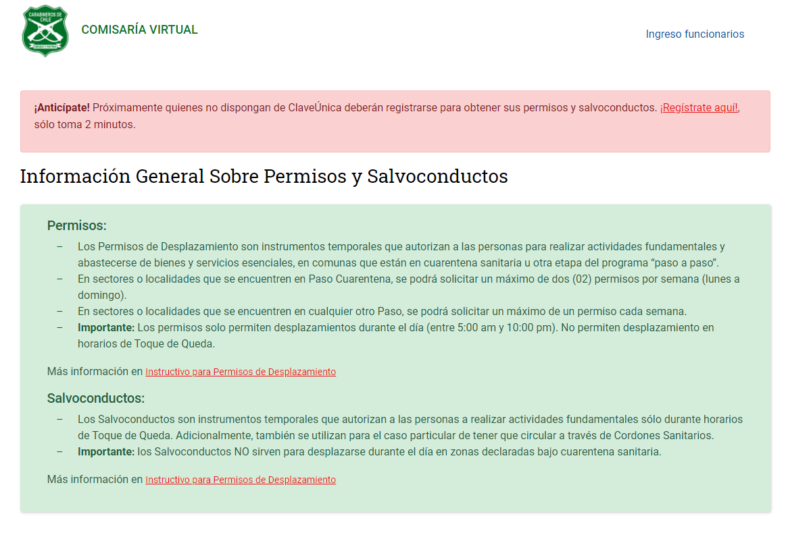
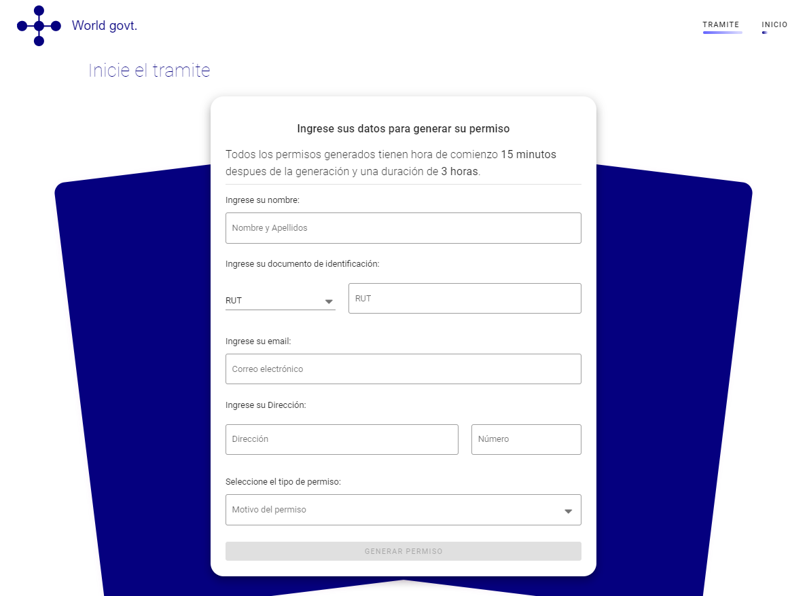
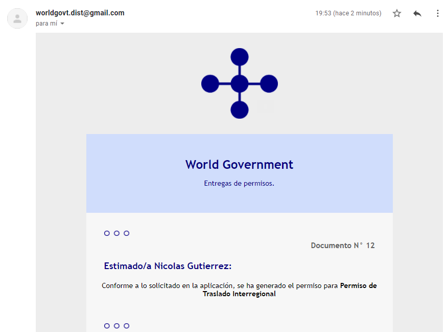
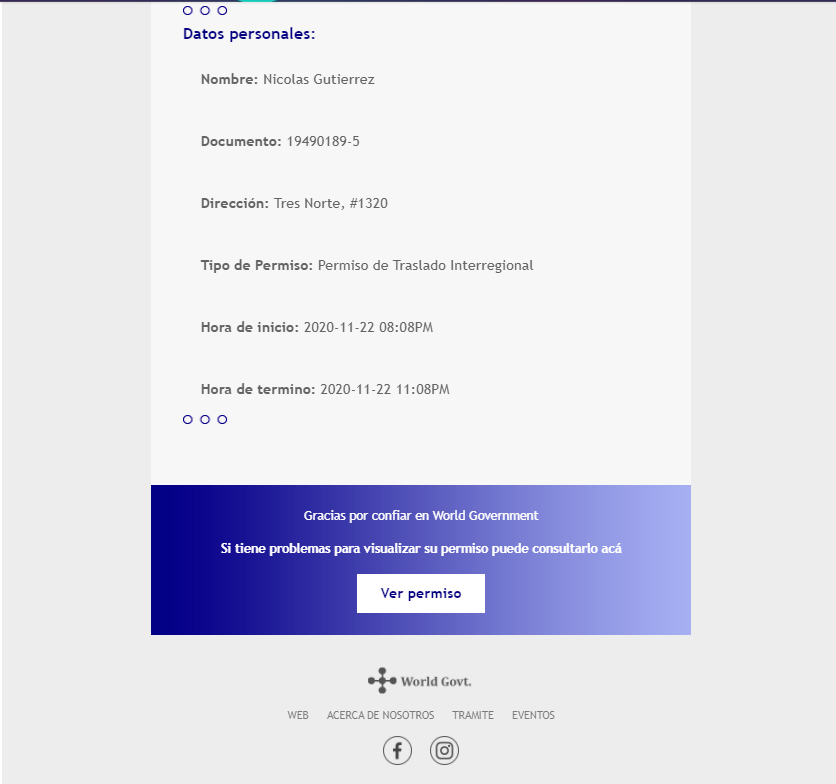
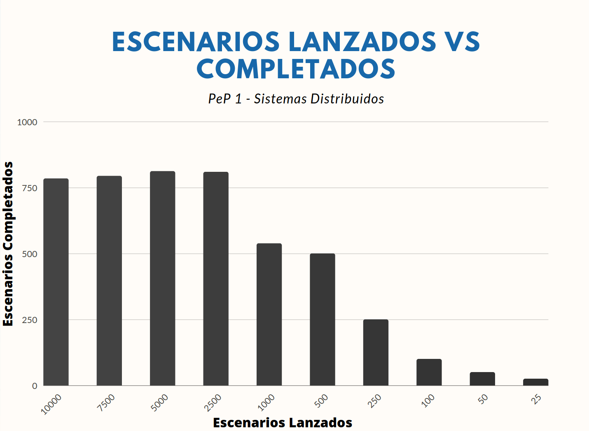

# Sistemas Distribuidos 2-2020

Integrantes del grupo:

  - Nicolás Gutiérrez - [ngutierrezp](https://github.com/ngutierrezp)
  - Javier Perez -[JavierPerezCaceres](https://github.com/JavierPerezCaceres)

## PEP-1

En esta entrega se requiere la implementación de un sistema que pueda generar y hacer envio de correo de permisos basados en la plataforma [Comisaria Virtual](https://comisariavirtual.cl/). 

Los requisistos de esta implementación es la creación de un sistema legado con un frontend y backend conectado a una base de datos. Se solicita además que :

  * Un formulario web básico de entrada de datos (RUN/DNI, Nombre, Dirección, Motivo del permiso)

  * Un sistema/modulo backend que se encargar´a de determinar la fecha y hora de solicitud del permiso, agregar una ventana de X minutos para la validez de este y escribir sobre la base de datos (tercer elemento) los datos del permiso generado.

  * Una tabla de base de datos, en la cual se almacenen todos los permisos generados.

## Tecnologias utilizadas

Las tecnologias utilizadas son:

* Vue.js (JavaScript)
* Ruby on Rails (Ruby)
* PostgreSQL (DB)

## Configuración del enterno

La información para la configuración de los enternos de desarrollo se encuentra en cada parte del proyecto:

  * [Frontend](frontend/README.md)
  * [Backend](backend/README.md)

## Estructura de la aplicación

### Vista de inicio

### Vista del formulario paga generar certificado

### Vista del permiso generado en la web

### Vista del correo enviado a la dirección ingresada

### Vista del contenido del correo

## Análisis del sistema

Acontinuación se muestra una tabla resumen del analisis del sistema:

| Caracteristica | Descripcion | Cumplimiento |
|-|-|-|
| Poner los recursos a disposición | Facilitar a los usuarios y aplicaciones acceder a recursos remotos de manera eficiente. | No se cumple. Esto debido a que al estar con un despliegue local, no se está facilitando ningún recurso de forma remota. Además no existe un sistema de autentificación y en cuanto a la seguridad, los datos no se encriptan al momento de enviarse desde el front al back y viceversa. |
| Transparencia de la distribución | Esconder el hecho que procesos y recursos están físicamente distribuidos en múltiples computadores. | No se cumple. Como se trabaja de forma local, los componentes no se encuentran distribuidos , es decir, todo se encuentra dentro de localhost con puertos específicos. Con esto, no existe transparencia en el acceso, migración, ubicación, replicación, persistencia, fallos, etc. |
| Apertura | Ofrecer servicios bajo reglas estándares.  | Si se cumple. El sistema ofrece los servicios estándares de API Rest. |
| Escalabilidad | Capacidad de un sistema de escalar vertical u horizontalmente. | No se cumple. El sistema no se encuentra replicado ni particionado ya que se está trabajando con una sola base de datos. El sistema tampoco soporta un escalamiento horizontal ya que no se encuentra distribuido. Tampoco se está trabajando con caché. |

## Capacidad de respuesta

Para poder analizar y evaluar la capacidad del sistema utilizamos un toolkit llamado artillery.
Este nos permite realizar test de capacidad para nuestra aplicación web, la manera en que hace este test es realizando X request en una ruta determinada (post en este caso) en un intervalo t de tiempo. Especificamente para testear la capacidad de respuesta dejamos constante el intervalo de tiempo en 1 segundo, y la cantidad de request las hicimos variar con los siguientes valores : [25, 50, 100, 250, 500, 1000, 2500, 5000, 7500, 10000].

En la siguiente tabla podremos ver especificamente la cantidad de escenarios que fueron lanzados versus la cantidad de escenarios que fueron completados

|Test|Escenarios Lanzados|Escenarios Completados|Diferencia|
|:---|:---:|:---:|:---:|
| 1 |10000|784| 9216|
| 2 |7500|794|6706|
| 3 |5000|812|4188|
| 4 |2500|809|1691|
| 5 |1000|538|462|
| 6 |500|500|0|
| 7 |250|250|0|
| 8 |100|100|0|
| 9 |50|50|0|
| 10 |25|25|0|

Principalmente como se puede ver en la tabla y en el gráfico, hasta que la cantidad de request no supera las 500 request los escenarios lanzados igualan a los escenarios completados, esto es lo esperado según la teoría ya que son pocas peticiones dividas dentro de 1 segundos. Luego podemos ver que la cantidad de escenarios completados, si bien no cubren la totalidad de los escenarios lanzados, incrementan constantemente ya que a más escenarios lanzados, se deberían completar más escenarios.
Luego llega un punto dentro del test 2 y el test 1 que los escenarios completados diminuyen, esto se debe a que la capacidad de la maquina se vea saturada con tantas request y esta no pueda procesar más de lo que puede, es en este momento que se genera una especie de cuello de botella que hace que se completen menos escenarios, y por este cuello de botella, baja la capacidad de la maquina para los test 1 y 2.
