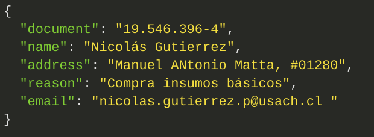

# README PeP 1.

## Run Server.

---

```bundle install```

```yarn install```

``` rails s```

---

## Database Credentials.

---

**db_name :** dist_database

**username:** postgres

**password:** secret

---

## Run Migration.

---

```rake db:migrate```

---

## Endpoints

#### Create User.

---

  [POST] /users

  Payload

  

---
